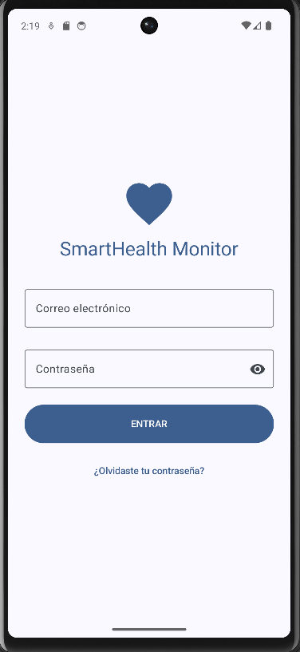
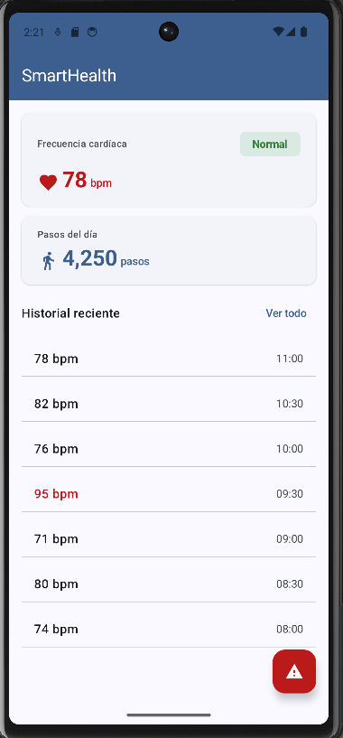
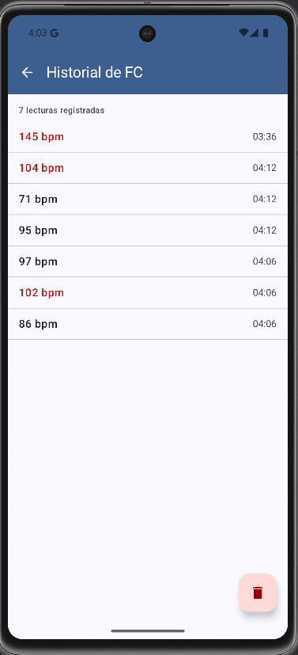
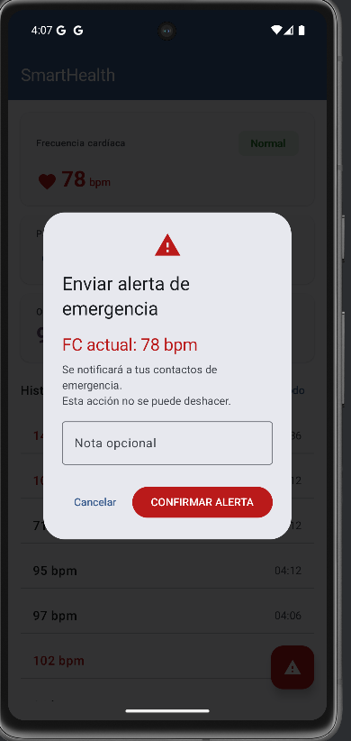

# SmartHealth Monitor


Aplicación Android de monitoreo de salud personal en tiempo real.  
Desarrollada como proyecto integrador — UTNG 9° Cuatrimestre 2025.

---

## Stack tecnológico

| Tecnología | Uso |
|---|---|
| Kotlin + Jetpack Compose | UI declarativa con Material Design 3 |
| Wearable Data Layer API | Comunicación reloj ↔ teléfono (BLE) |
| Health Services API | Sensor FC real en background (Wear OS) |
| Room Database | Historial persistente de lecturas FC |
| Jetpack Navigation | NavHost entre 4 pantallas |
| GitHub + Conventional Commits | Control de versiones profesional |

---

## Pantallas

| Pantalla | Descripción |
|---|---|
| LoginScreen | Autenticación con validación y State |
| DashboardScreen | FC y Pasos en tiempo real del wearable |
| HistorialScreen | Lecturas persistidas en Room con Flow reactivo |
| AlertaScreen | AlertDialog MD3 + Snackbar de confirmación |

---

## Capturas de pantalla

| Login | Dashboard |
|---|---|
|  |  |

| Historial | Alerta |
|---|---|
|  |  |

---

## Arquitectura

```
SmartHealthMonitor/
├── app/
│   └── src/main/java/mx/utng/smarthealthmonitor/
│       ├── data/
│       │   ├── db/              # Room: LecturaFC, LecturaFCDao, SmartHealthDB
│       │   ├── models/          # MockData para desarrollo
│       │   ├── SmartHealthRepository.kt
│       │   └── WearListenerService.kt
│       ├── navigation/          # NavGraph + Screen routes
│       ├── ui/
│       │   ├── components/      # TarjetaDato, FilaHistorial
│       │   ├── screens/         # Login, Dashboard, Historial, Alerta
│       │   ├── theme/           # Color.kt, Type.kt, Theme.kt (MD3)
│       │   └── viewmodel/       # DashboardViewModel
│       └── SmartHealthApp.kt    # Application class — Room init
└── wear/
    └── src/main/java/mx/utng/smarthealthmonitor/wear/
        ├── HealthDataService.kt  # PassiveMonitoringClient (Health Services API)
        ├── WearDataSender.kt     # Wearable Message API
        └── WearMainActivity.kt   # SensorManager + botón de simulación
```

---

## Flujo de datos

```
Wear OS Emulator (Virtual Sensors slider)
        ↓  SensorManager (TYPE_HEART_RATE)
WearMainActivity.onSensorChanged()
        ↓  WearDataSender.enviarFC(bpm)
        ↓  Wearable Message API (BLE)
WearListenerService.onMessageReceived()
        ↓  SmartHealthRepository.actualizarFC(bpm)
        ↓  Room.insertar(LecturaFC) + StateFlow update
DashboardViewModel (collectAsState)
        ↓
DashboardScreen + HistorialScreen (UI actualizada en tiempo real)
```

---

## Commits por sesión

| Sesión | Commits clave |
|---|---|
| S6 — Wearable Data Layer | `feat: add WearListenerService and WearDataSender` |
| S7 — Room DB + HistorialScreen | `feat: add Room DB (LecturaFC Entity, DAO, SmartHealthDB)` |
| S7 — Reto adicional | `refactor: add automatic cleanup of old FC readings` |
| S8 — AlertaScreen | `feat: add AlertaScreen with AlertDialog MD3, spinner and preview` |
| S8 — Snackbar + Deshacer | `feat: add undo action to alert Snackbar` |

---

## Cómo ejecutar

1. Clonar el repositorio:
   ```bash
   git clone https://github.com/omarsalinas3/SmartHealthMonitor.git
   ```
2. Abrir en **Android Studio Ladybug** o superior.
3. Crear dos emuladores: **Pixel 7 (API 34+)** y **Wear OS Square (API 36)**.
4. Emparejar los emuladores con **Tools → Wear OS Emulator Pairing Assistant**.
5. Correr el módulo `app` en el Pixel 7 y el módulo `wear` en el Wear OS.
6. En los Extended Controls del reloj → Virtual Sensors → mover el slider de **Heart rate (bpm)**.

---

## Rúbrica cumplida

| Criterio | Estado |
|---|---|
| LoginScreen funcional con validación | ✅ |
| DashboardScreen reactivo con ViewModel | ✅ |
| HistorialScreen desde Room con Flow | ✅ |
| AlertaScreen: Dialog + Snackbar + Deshacer | ✅ |
| Wearable Data Layer + Health Services | ✅ |
| GitHub: repo público + README + commits | ✅ |
| Conventional Commits verificables | ✅ |
| 3 PRs mergeados (S6, S7, S8) | ✅ |
| Paleta MD3 — sin colores hardcodeados | ✅ |
| WCAG AA + sp en textos + 48dp táctil | ✅ |

---

## Autor

**Omar Salinas** — UTNG — Ing. en Desarrollo y Gestión de Software  
📧 Contacto: a22350549@utng.edu.mx
